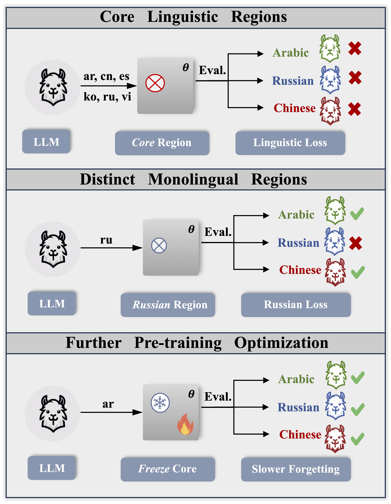
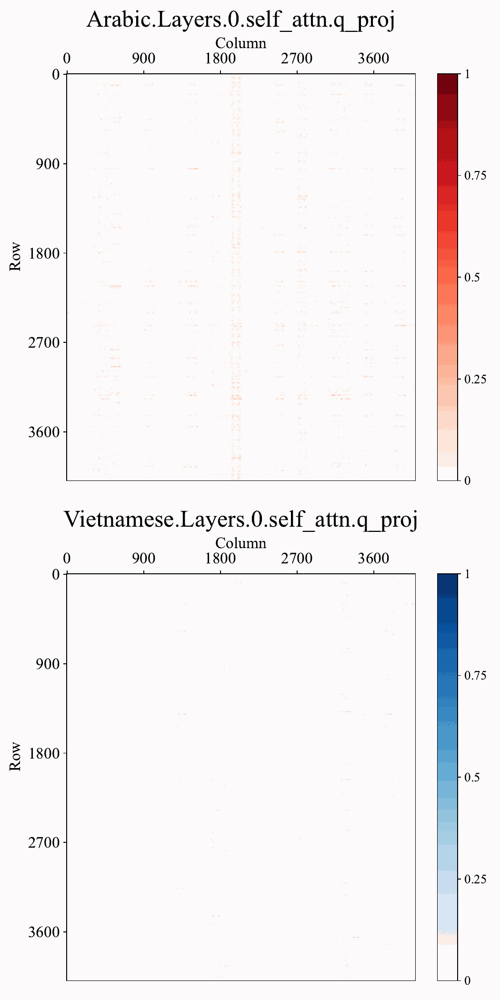

# Unveiling-Linguistic-Regions-in-LLMs





## 🔥 News
<!---
-->
* **[2024-05.28]** Accepted by ACL 2024.🎉 The preprint of our paper can be found [here](https://arxiv.org/abs/2402.14700).
* **[2024-05.30]** We released our data_preprocessing code.
* **[2024-06.09]** We released our training code.

## 💻Code Start
<h3 id="0">🛠️ Environment Configuration</h3>

```sh
conda create -n test python=3.10 -y
conda activate test

conda install pytorch==1.13.1 torchvision==0.14.1 torchaudio==0.13.1 pytorch-cuda=11.6 -c pytorch -c nvidia

conda install datasets accelerate safetensors chardet cchardet wandb nvitop -c huggingface -c conda-forge -y

pip3 install transformers sentencepiece einops ninja deepspeed-kernels tqdm

pip list | grep ninja && pip3 install flash-attn

DS_BUILD_OPS=1 DS_BUILD_SPARSE_ATTN=0 DS_BUILD_CUTLASS_OPS=0 DS_BUILD_RAGGED_DEVICE_OPS=0 DS_BUILD_EVOFORMER_ATTN=0 pip install deepspeed
```

<h3 id="1">📖 Data Preprocess</h3>
<p>
  <h4> Thanks to Open-Sourced Code: </h4>
  <a href="https://github.com/zjunlp/KnowLM/tree/main/pretrain">
    
  </a>
  <a href="https://github.com/zjunlp/KnowLM/tree/main/pretrain" style="vertical-align:middle; margin-left: 10px;">KnowLM-Pretrain</a>
</p>

```sh
cd data_preprocess
mkdir -p path_to_save
# preprocess your data
python preprocess-llama.py \
    --mode "write" \
    --file_path "example.jsonl" \
    --save_prefix "train" \
    --save_path "path_to_save/" \
    --language "chinese" \
    --do_keep_newlines \
    --seq_length 512 \
    --tokenizer_path 'LLaMA-2-Tokenizer' \
    --num_workers 16

# read your processed data
python preprocess-llama.py \
    --mode="read" \
    --read_path_prefix="./path_to_save/train" \
    --tokenizer_path 'LLaMA-2-Tokenizer'
```


<h3 id="2">⏳ Training</h3>
<p>
  <h4> Thanks to Open-Sourced Code: </h4>
  <a href="https://github.com/microsoft/DeepSpeedExamples">
    
  </a>
  <a href="https://github.com/microsoft/DeepSpeedExamples/tree/master/applications/DeepSpeed-Chat" style="vertical-align:middle; margin-left: 10px;">DeepSpeed-Chat</a>
</p>

#### 📝 Gradient Accumulation
```sh
cd training/step1_supervised_finetuning

export CUDA_VISIBLE_DEVICES=0,1,2,3,4,5,6,7
total_cards=8

PRETRAIN_OUT=$1
ZERO_STAGE=$2

if [ "$PRETRAIN_OUT" == "" ]; then
    PRETRAIN_OUT=./default_path_to_save
fi

mkdir -p $PRETRAIN_OUT
echo $PRETRAIN_OUT

deepspeed accumulate_grad_mul_params_on_multi_languages.py  \
    --model_name_or_path path_to_model \
    --pretrain_train_data_path path_to_preprocessed_data/train \
    --pretrain_test_data_path path_to_preprocessed_data/test \
    --max_seq_len 512 \
    --learning_rate 5e-5 \
    --weight_decay 0.001 \
    --total_cards $total_cards \
    --per_device_train_batch_size 8 \
    --gradient_accumulation_steps 4 \
    --per_device_eval_batch_size 16 \
    --zero_stage 2 \
    --seed 1234 \
    --deepspeed \
    --output_dir $PRETRAIN_OUT \
    &> $PRETRAIN_OUT/training.log
```

#### ❄️ Region Freeze Train
```sh
cd training/step1_supervised_finetuning

export CUDA_VISIBLE_DEVICES=0,1,2,3,4,5,6,7
total_cards=8

PRETRAIN_OUT=$1
ZERO_STAGE=$2

if [ "$PRETRAIN_OUT" == "" ]; then
    PRETRAIN_OUT=./default_path_to_save
fi

mkdir -p $PRETRAIN_OUT
echo $PRETRAIN_OUT

deepspeed region_freeze_train.py  \
    --model_name_or_path path_to_model \
    --pretrain_train_data_path path_to_preprocessed_data/train \
    --pretrain_test_data_path path_to_preprocessed_data/test \
    --english_test_data_path path_to_english_data/test \
    --region_dir path_to_region_freeze \
    --max_seq_len 512 \
    --learning_rate 5e-5 \
    --weight_decay 0.001 \
    --total_cards $total_cards \
    --per_device_train_batch_size 2 \
    --gradient_accumulation_steps 16 \
    --per_device_eval_batch_size 16 \
    --zero_stage 2 \
    --seed 1234 \
    --deepspeed \
    --output_dir $PRETRAIN_OUT \
    &> $PRETRAIN_OUT/training.log
```

### 🔍Region Selection
#### Core Linguistic Region
```sh
cd region_selection
python extract_accumulated_core_linguistic_region.py
```
#### Monolingual Region
```sh
cd region_selection
python extract_accumulated_monolingual_region.py
```


## 🎯Generation Case
### Outlier Dimension Perturbation
> Here we use ***“Fudan University is located in”*** as prompt.

<!--  -->

### Monolingual Regions Removal
> Here we use ***"There are 365 days in a year and 12"*** as prompt.

<!--  -->

## 👓Regions Visualization
### Core Linguistic Region
> The **'Top 5%'** region in Attention.o and MLP.down.
<p align="center">
  
</p>


### Monolingual Regions
> The **'Arabic'** and **'Vietnamese'** regions in Attention.q.
<p align="center">
  
</p>


## 👋Others

### Reference
If you found our paper helpful, please consider citing:
```bibtex
@article{zhang2024unveiling,
  title={Unveiling Linguistic Regions in Large Language Models},
  author={Zhang, Zhihao and Zhao, Jun and Zhang, Qi and Gui, Tao and Huang, Xuanjing},
  journal={arXiv e-prints},
  pages={arXiv--2402},
  year={2024}
}
```

### Acknowledgements

Thanks to previous open-sourced repo: 
* [DeepSpeedExamples](https://github.com/microsoft/DeepSpeedExamples)
* [KnowLM](https://github.com/zjunlp/KnowLM)
